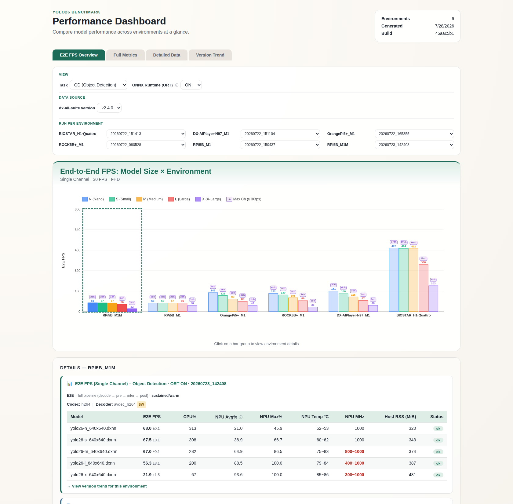
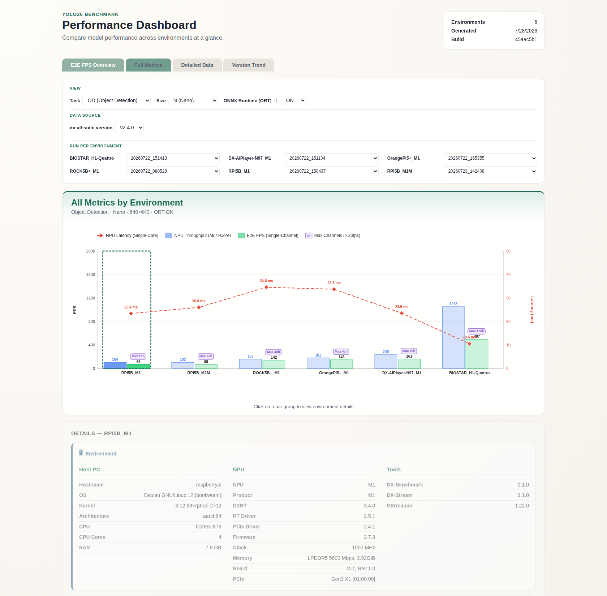
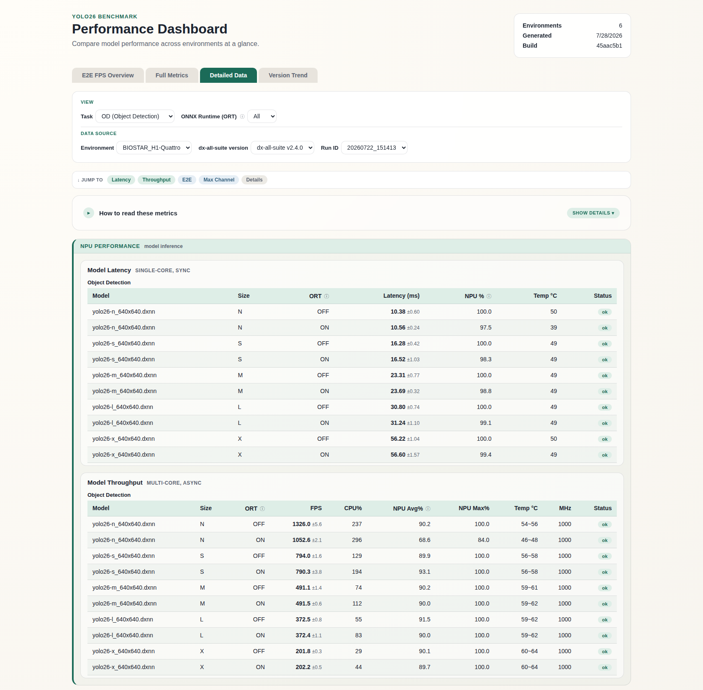
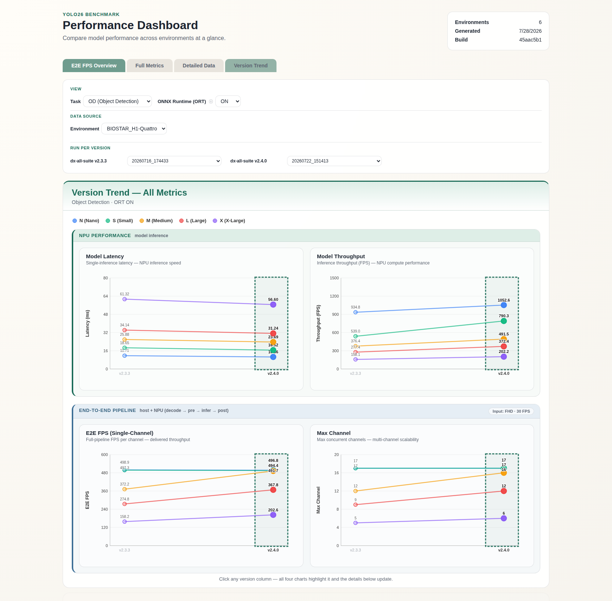
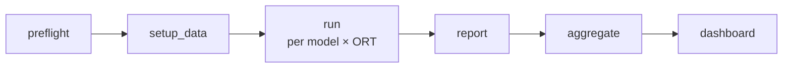

# DX-Benchmark — YOLO26 on DEEPX NPU

Reproducible YOLO26 performance benchmarking on the DEEPX NPU — one standardized
procedure across any Host PC + NPU combination. It measures two tiers:

- **Model-Level** (direct `run_model`) — **Latency** (single-core, sync) and **Throughput** (multi-core, async)
- **E2E Pipeline** (full GStreamer / DX-Stream) — **Single-Stream** FPS and **Multi-Stream** channel capacity

Both tiers run automatic ONNX-Runtime ON/OFF comparison with thermal-throttle detection,
then render an interactive dashboard for cross-environment and cross-version comparison.

> **Status:** Beta (tool `v0.1.0`). Data is final; the CLI and output schema may still evolve.

---

## At a Glance

Practical performance of the lightest **nano** model on the current release
(**dx-all-suite v2.4.0**), Full HD (1920×1080) 30 fps input, **`end-to-end FPS / max
concurrent channels`** (better of ORT ON/OFF):

| Environment | NPU | Object Detection (nano) | Note |
|-------------|-----|------------------------:|------|
| **BIOSTAR_H1-Quattro** | H1 (4-chip) | **496.8 fps / 17 ch** | highest channel density |
| **DX-AIPlayer-N97_M1** | M1 | 184.9 fps / 6 ch | x86, balanced edge box |
| **OrangePi5+_M1** | M1 | 148.1 fps / 4 ch | RK3588, PCIe ×4 |
| **ROCK5B+_M1** | M1 | 141.5 fps / 4 ch | RK3588, PCIe ×2 |
| **RPi5B_M1** | M1 | 80.1 fps / 2 ch | PCIe ×1, SW decode |
| **RPi5B_M1M** | M1M | 79.8 fps / 2 ch | M1M SKU (slower tier) |

**Three headline findings** (full data + method in [`docs/ANALYSIS_EN.md`](docs/ANALYSIS_EN.md) · [한국어](docs/ANALYSIS_KOR.md)):

1. **The DEEPX M1 NPU is the performance anchor.** On medium/large/x-large models the four
   very different single-M1 hosts agree to within a few percent — the host mostly affects
   only the lightest models and the video pipeline.
2. **v2.3.3 → v2.4.0 gained ~25–35%** on NPU-bound detection models, consistently across
   every environment.
3. **H1-Quattro scales ~4.2–4.3×** a single M1 with its four NPU chips.

---

## Interactive Dashboard

Every result set renders to a self-contained HTML dashboard (no CDN, works offline).
Four tabs cover the full picture — from a one-glance comparison to raw per-model tables
and release-over-release trends:

<table>
  <tr>
    <td width="50%" valign="top">
      <a href="docs/images/dashboard-01-fps-overview.png"></a>
      <br><b>E2E FPS Overview</b> — grouped E2E FPS by model size × environment, with max-channel badges.
    </td>
    <td width="50%" valign="top">
      <a href="docs/images/dashboard-02-full-metrics.png"></a>
      <br><b>Full Metrics</b> — latency (line) + throughput + E2E FPS + max channels in one combo chart.
    </td>
  </tr>
  <tr>
    <td width="50%" valign="top">
      <a href="docs/images/dashboard-03-detailed-data.png"></a>
      <br><b>Detailed Data</b> — full numeric tables (latency/throughput/E2E/capacity) with filters.
    </td>
    <td width="50%" valign="top">
      <a href="docs/images/dashboard-04-version-trend.png"></a>
      <br><b>Version Trend</b> — per-metric trend across dx-all-suite releases for the same hardware.
    </td>
  </tr>
</table>

> Click any thumbnail for the full-resolution view.

Launch it locally:

```bash
./run.sh dashboard results          # build results/dashboard/ from all runs
cd results/dashboard && python3 -m http.server 8899
# open http://localhost:8899/
```

| Tab | What it shows |
|-----|---------------|
| **E2E FPS Overview** | E2E FPS comparison by Task/ORT (grouped bars by model size); max-channel badge above each bar. |
| **Full Metrics** | Cross-environment NPU latency, throughput, and E2E FPS per Task/Size/ORT (latency as a dashed line on the secondary axis). |
| **Detailed Data** | Full numeric tables with Environment/Task/ORT filters and a Run-ID selector. |
| **Version Trend** | Per-metric line charts across dx-all-suite releases for the same HW_ID (Latency / Throughput / E2E FPS / Max Channel). |

---

## Quick Start

```bash
cd /path/to/dx-benchmark

# 1) Verify tools + print an environment fingerprint
./run.sh preflight

# 2) One-time: download models + videos (no sudo) and provision host deps (sudo)
./setup_data.sh
sudo ./setup_host.sh

# 3) Run the full suite (model-level + end-to-end + multi-stream)
./run.sh run

# 4) Build + view the dashboard
./run.sh dashboard results
cd results/dashboard && python3 -m http.server 8899
```

---

## How It Works

Top-level pipeline — `run` measures every **model × ORT mode**, then the results feed the
report and dashboard:



Inside `run`, each model × ORT mode goes through a thermal-normalized sequence —
**cooldown → latency (cold) → throughput → cooldown → E2E → multi-stream** — so latency is
measured cold, throughput heats the NPU, and a second cooldown lets E2E/multi measure their
own steady state. Throttling is detected and flagged, never hidden. Full detail in
[Per-Model Execution Order](#per-model-execution-order-thermal-normalization).

---

## Key Features

- **Model-Level Benchmarks** — NPU throughput/latency via direct `run_model` execution.
- **E2E Pipeline Benchmarks** — full GStreamer pipeline FPS through DX-Stream (single-stream).
- **Multi-Stream Benchmarks** — boundary channel-count search from single-stream FPS.
- **Thermal monitoring & steady-state normalization** — NPU temp/clock (MHz) tracking,
  hot-start rejection, per-model cooldown, and automatic throttle detection.
- **Automatic ORT ON/OFF comparison** — both modes measured in every run.
- **Environment fingerprinting** — full measurement context captured for reproducibility
  (host, NPU stack, tool version, protocol).
- **Reports & dashboard** — Markdown `REPORT.md` per run + a static interactive HTML dashboard.
- **Version trend tracking** — performance across dx-all-suite releases for the same HW_ID.
- **Resume / retry-failed** — continue interrupted runs or rerun only failed conditions.

## Supported Tasks

| Task | Model-Level | E2E Pipeline | Multi-Stream |
|------|:-----------:|:------------:|:------------:|
| Object Detection | O | O | O |
| Pose Estimation | O | O | O |
| Segmentation | O | O | O |
| Oriented BBox (OBB) | O | O | O |
| Classification | O | O | — |

> OBB uses 1024×1024 input, Classification uses 224×224 (keep-ratio=false), all others 640×640.
> Classification Multi-Stream is excluded — a 224×224 classifier is not representative of
> real multi-stream video-analytics workloads.

## Prerequisites

- **OS**: Linux (x86_64 or arm64) with a DEEPX NPU (DX-M1 / DX-H1).
- **Python 3.9+** — standard library only, no third-party pip packages required.
- **DEEPX runtime installed** — the benchmark drives already-installed artifacts, not source:
  - `run_model`, `gst-launch-1.0`, `gst-inspect-1.0`, `dxrt-cli` on `PATH`
  - dx_stream GStreamer plugin (`libgstdxstream.so`) and postprocess libraries under
    `/usr/local/share/gstdxstream/lib/`
  - Install via the suite: `dx-runtime/install.sh --all` (see the dx-all-suite README).
- **System tools**: `time` (GNU), `jq`, `ffmpeg` (provides `ffprobe`), `curl`, `tar`.
  Install them all in one shot with `sudo ./setup_host.sh` (apt), or manually on non-apt
  distros (e.g. `dnf install time jq ffmpeg curl tar`).
- **Network access** to `https://sdk.deepx.ai` to download benchmark models/videos.
- Run `./run.sh preflight` first — it verifies the tools above (always-required plus the
  E2E prerequisites) and prints an environment fingerprint.

Then download data once: `./setup_data.sh` (models + videos; no sudo). For host
provisioning (system deps + passwordless dxrt restart + journal access), run
`sudo ./setup_host.sh`.

> **For comparable numbers**: the fingerprint records your CPU governor, NPU/CPU clocks,
> and thermal state so every run is traceable. You do **not** need a specific CPU governor
> — the benchmark reports whatever your host actually uses (the as-deployed number). Just
> keep conditions (cooling, power, background load, governor) consistent across the runs
> you compare.

## Usage

### 1. Environment Check

```bash
cd /path/to/dx-benchmark
./run.sh preflight
# raw equivalent (from dx-benchmark/): python3 -m benchmark preflight
# tool version: python3 -m benchmark --version
```

### 2. Dry-Run (Preview Matrix)

```bash
./run.sh dry-run
./run.sh dry-run --sizes n,s --task object_detection
```

### 3. Run Benchmarks

```bash
# Full suite (model + e2e + multi-stream)
./run.sh run

# Run by family
./run.sh run --family model
./run.sh run --family e2e
./run.sh run --family multi

# Limit sizes / time
./run.sh run --sizes n,s --family model --model-time 30

# Resume interrupted run
./run.sh run --resume results/BIOSTAR_H1-Quattro/20260722_151413

# Retry failed conditions only
./run.sh run --resume results/BIOSTAR_H1-Quattro/20260722_151413 --retry-failed
```

### 4. Regenerate Report

```bash
# Specify a {hw_id}/{run_id} result directory path
./run.sh report results/BIOSTAR_H1-Quattro/20260722_151413
```

### 5. Aggregate Results

```bash
# Aggregate multiple environment/run results into a single dataset.json
./run.sh aggregate results
./run.sh aggregate results --output /tmp/dataset.json
```

### 6. Build Dashboard

```bash
# Aggregate + generate dashboard
./run.sh dashboard results
# → generates index.html, app.js, styles.css, dataset.json under results/dashboard/

# Custom output directory
./run.sh dashboard results --output /tmp/dashboard

# Local preview
cd results/dashboard && python3 -m http.server 8899
```

Pure HTML/CSS/JS with no external CDN — works fully offline.

### 7. Version Trend Tracking

Compare benchmark results before and after dx-all-suite releases using the same HW_ID.

```bash
# (1) Run benchmark on each environment
./run.sh run

# (2) Bump dx-all-suite version (release.ver or --dx-all-suite-version), run again on the same HW
./run.sh run

# (3) Generate dashboard from nested results root → check Version Trend tab
./run.sh dashboard results
```

Results always follow the `results/{hw_id}/{run_id}/` structure. HW_ID is automatically
computed from the `environment.json` fingerprint during `run`.

- With `--product-name`: `{product_name}_{hw_config}` (e.g., `DX-AIPlayer-N97_M1`)
- Without: `{hostname}_{hw_config}` (e.g., `RPi5B_M1`)

The version is captured per run, resolved in this order:

- `--dx-all-suite-version v2.4.0` passed to `run` (explicit — always wins), **or**
- run in-suite: auto-read from the suite-root `release.ver` (walked up from the package dir), **or**
- on an interactive terminal with neither available: you are prompted for it, **or**
- otherwise (headless / unattended): a `[WARN]` is printed and the run is recorded with
  version `unknown`.

> **Unattended runs:** always pass `--dx-all-suite-version` explicitly for headless jobs —
> otherwise, on a TTY with no `release.ver`, the run pauses at the interactive prompt.

## CLI Options

### `run` / `dry-run` Common Options

| Option | Default | Description |
|--------|---------|-------------|
| `--task` | `all` | Task type (`all`, `object_detection`, `pose_estimation`, `segmentation`, `oriented_bbox`, `classification`) |
| `--sizes` | `n,s,m,l,x` | Model sizes to measure (comma-separated) |
| `--family` | `all` | Benchmark family: `model`, `e2e`, `multi`, `all` |
| `--model-time` | 30 | Model-level throughput measurement duration (seconds, `run_model -t`). Latency uses fixed 300 loops (`-l`) |
| `--warmup` | 1 | Warmup run count |
| `--runs` | — | Override all repetition counts to the same value. Defaults: latency=1, throughput=3, e2e=3 |
| `--fps-threshold` | 30 | Per-channel minimum FPS threshold for multi-stream |
| `--video` | Auto per task | Override input video path (applied to all tasks) |
| `--output` | `results/` | Output root directory. Actual output: `<output>/<hw_id>/<run_id>/` |
| `--resume` | — | Resume from an existing result directory |
| `--retry-failed` | — | With `--resume`, rerun only entries not in `ok`/`partial` status |
| `--product-name` | — | Product name. Used in HW_ID instead of hostname (e.g., `DX-AIPlayer-N97`) |
| `--dx-all-suite-version VER` | Auto (`release.ver`) | dx-all-suite release version for the Version Trend axis (e.g. `v2.4.0`) |

### Subcommands

| Command | Description |
|---------|-------------|
| `--version` | Print the dx-benchmark tool version and exit |
| `preflight` | Check tool availability + print environment fingerprint |
| `dry-run` | Preview benchmark matrix (no execution) |
| `run` | Execute benchmarks |
| `report <result_dir>` | Regenerate Markdown report from existing results |
| `aggregate <results_root> [--output PATH]` | Aggregate results into dataset.json |
| `dashboard <results_root> [--output DIR]` | Generate static HTML dashboard |

## Directory & Output Structure

```
dx-benchmark/
├── run.sh          # launcher
├── setup_data.sh   # data setup: download models + videos (no sudo)
├── setup_host.sh   # one-time host provisioning (sudo): system deps + dxrt sudoers + journal
├── docs/           # ANALYSIS_EN.md, ANALYSIS_KOR.md, images/ (dashboard screenshots)
├── benchmark/      # python package (python3 -m benchmark)
└── results/
    ├── <hw_id>/<run_id>/   # tracked: *_results.json + environment.json + REPORT.md
    │                       # git-ignored (local-only): raw/, incidents/, *.csv
    └── dashboard/          # tracked build artifacts (index.html/app.js/styles.css/dataset.json)
```

Per-run output:

```
results/{hw_id}/{run_id}/
├── environment.json              # tracked — fingerprint + timing + timing_history
├── model_results.json            # tracked — model-level results (throughput + latency)
├── pipeline_results.json         # tracked — E2E single-stream results
├── multi_stream_results.json     # tracked — multi-stream boundary search results
├── REPORT.md                     # tracked — comprehensive Markdown report
├── *_results.csv                 # git-ignored — CSV mirror of the JSON (identical columns)
├── raw/                          # git-ignored — raw logs (.log + .npu.log + profiler.json)
└── incidents/                    # git-ignored — timeout diagnostic snapshots (when applicable)
```

> **What ships in git:** the compact per-run JSON summaries + `REPORT.md`, plus the built
> dashboard. The large `raw/` logs, `incidents/` diagnostics, and the `*.csv` mirrors are
> regenerated locally by `run`/`report` and are **git-ignored**. The `*_results.json` files
> are the lossless source of truth (the CSVs carry identical columns), so `aggregate`,
> `dashboard`, `report`, and `--resume` all read JSON — a fresh clone can rebuild everything.

## Measurement Protocol

| Parameter | Value |
|-----------|-------|
| Throughput duration (`-t`) | 30s |
| Latency loops (`-l`) | 300 loops (`run_model -s` mode ignores `-t`, uses `-l` only) |
| Warmup | 1 run |
| Latency runs | 1 |
| Throughput runs | 3 |
| E2E runs | 3 (uniform across all tasks) |
| ORT modes | ON + OFF |
| Thermal mode | steady |
| Hot-start block | 60°C (benchmark start rejected if exceeded) |
| Cooldown points | ① before model-level (fatal) · ④ before E2E/multi — protocol v1 (non-fatal) |
| Cooldown target | `min(idle + Δ10°C, 55°C)` |
| Cooldown timeout | 1000s — model-level: RuntimeError; pre-E2E: warn + proceed |
| NPU warmup / drain | 1.0s / 0.5s |
| NPU clock monitoring | dxtop Core Clock MHz (during measurement) + dxrt-cli pre/post snapshots |
| CPU clock monitoring | sysfs scaling_cur_freq pre/post snapshots |
| Multi-stream 1ch | Reuses single-stream result |
| Multi-stream max streams | 128 (safety cap) |
| Process timeout | `run_model`: 600s/run; E2E/multi: 90s no-progress stall + 1800s hard cap |
| Graceful shutdown | SIGTERM → 10s wait → SIGKILL (2-phase) |
| Retry (model / E2E / multi) | warmup: 1 retry on timeout; measured runs: up to 2 backfill attempts |
| NPU recovery | Automatic dxrt.service restart after SIGKILL |

> **Reading NPU %** — Throughput/E2E/Multi report NPU **core utilization** sampled by
> dxtop over the run (sustained load). Latency reports NPU **occupancy**
> (`npu_task_ms / total_ms`, from the profiler): a sub-second single-core run is too
> short for dxtop's ~1 Hz sampler, so its clock/throttle are omitted and shown only for
> the sustained metrics. A red clock elsewhere means it dropped below the nominal rated
> clock under load (throttling) — idle DVFS downclock is not throttling.

## Per-Model Execution Order (Thermal Normalization)

Each model × ORT combination follows these steps sequentially. The protocol uses **two
cooldown points** — one before the model-level phase, one before the E2E phase — so each
measurement runs at a controlled thermal state:

```
── [1/N] yolo26-n_640x640.dxnn  ORT=ON  (object_detection) ──

  ① Cooldown → reject start above 60°C; wait until ≤ min(idle + Δ10°C, 55°C)   (when the model family is included)
  ② Latency    → single-core sync mode (-l 300 loops), profiler-based NPU/CPU ms   (cold state)
  ③ Throughput → multi-core async mode, FPS (3 runs)                              (sustained load heats the NPU)
  ④ Cooldown (protocol v1) → shed the throughput burst's residual heat            (when the e2e/multi family is included)
  ⑤ E2E Single-Stream → full GStreamer pipeline FPS (3 runs)
  ⑥ Multi-Stream Sweep → estimate start from single-stream FPS, then boundary search

→ next model × ORT combination (repeat from ①)
```

- ② Latency runs from cold — the profiler cleanly separates NPU/CPU time with minimal heating.
- ③ Throughput (30s × 3) heats the NPU to a sustained load.
- ④ The **pre-E2E cooldown (protocol v1)** sheds the throughput burst's residual heat so
  E2E and multi-stream measure their *own* sustained steady state, rather than a state
  inflated by the preceding throughput burst.
- ⑤/⑥ E2E then multi-stream run back-to-back at that steady state (no cooldown between them).
- **Cooldown failure differs by point:** the model-level cooldown ① is fatal (RuntimeError
  on the 1000s timeout); the pre-E2E cooldown ④ is non-fatal — it warns and proceeds
  (E2E measured hot). If both latency and throughput time out, E2E/Multi-Stream are skipped
  for that model.

## Timeout Recovery and Retry Strategy

GStreamer pipelines or `run_model` processes can occasionally hang (deadlock, NPU hang).
A 3-layer recovery structure handles these cases.

**Layer 1 — Graceful shutdown (SIGTERM → SIGKILL).** On a `run_model` 600s timeout, an
E2E/multi 90s no-progress stall, or the 1800s hard cap: SIGTERM to the process group →
10s wait → SIGKILL if needed → NPU device recovery.

> Force-killing `gst-launch-1.0` destroys dxrtd's IPC message queue (Error 43: Identifier
> removed), so all subsequent NPU inference fails — device recovery is mandatory.

**Layer 2 — Python-level retry.** Unified across families via two knobs —
`model_warmup_retries` (default 1) and `model_run_retries` (default 2):

| Phase | Retries | Notes |
|-------|:-------:|-------|
| Warmup (model / E2E / multi) | 1 | 1 retry on timeout before giving up the cell |
| Measured run (model / E2E / multi) | up to 2 | Backfill failed/timed-out runs toward the target; remaining successes are averaged |
| Multi-stream sweep | up to 2 / channel | Same backfill budget per stream count |

When both model-level phases (latency + throughput) time out, E2E and multi-stream are
skipped for that model × ORT combination.

**Incident diagnostics.** On timeout, snapshots are saved to `incidents/`: `dxrt-cli -s`
status, `systemctl status dxrt.service`, recent `journalctl`/`dmesg`, a process-tree dump,
and an NPU temperature/clock snapshot.

**NPU device recovery** (when SIGKILL was required): `pkill -9 gst-launch-1.0` /
`run_model` → `sudo -n systemctl restart dxrt.service` (3s settle).

> Passwordless sudo is required for NPU recovery and incident diagnostics. Run
> `sudo ./setup_host.sh` — it writes `/etc/sudoers.d/benchmark-dxrt` granting the current
> user NOPASSWD for exactly these commands (and nothing else):
> `systemctl restart dxrt.service`, `dmesg`, `journalctl -u dxrt.service`, and `lspci`
> (the last three are for incident-diagnostic collection on timeouts).

## Development / Testing

No third-party runtime dependencies (standard library only). The test suite uses `pytest`
(a dev-only dependency):

```bash
cd /path/to/dx-benchmark
pip install pytest          # dev-only; not needed to run benchmarks
python3 -m pytest tests/
```

The repo-root `conftest.py` is intentionally empty — its presence sets the pytest
`rootdir` and puts the package root on `sys.path`, so `import benchmark` resolves without
any install or `PYTHONPATH` tweaks.

**Analysis-document gate.** `tests/test_analysis_doc_values.py` recomputes every number
printed in `docs/ANALYSIS_EN.md` / `docs/ANALYSIS_KOR.md` from the committed
`results/<env>/<run>/*_results.json` and fails if the document disagrees — tables, derived
statistics (coefficient of variation, ORT gain ranges, throttle spreads) and the prose
figures alike. Run it after adding measurement data or editing the analysis documents:

```bash
python3 -m pytest tests/test_analysis_doc_values.py -v
```

It resolves runs the same way the dashboard does (highest `dx_all_suite_version` present =
current release, next-highest = trend baseline), and skips itself when fewer than two
versions are committed.

## License

See [`LICENSE`](LICENSE). Provided for use with DEEPX NPU products.
